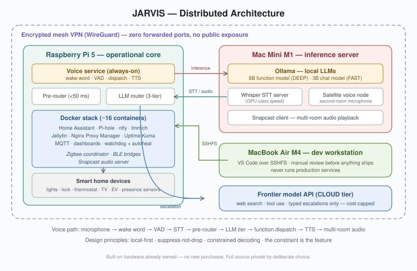

# JARVIS: A Voice-Driven AI Home Assistant

**An always-listening, multi-room voice assistant built on commodity hardware: a Raspberry Pi 5, a Mac Mini M1, and a lot of Python that controls the home, the car, and personal logistics through natural conversation.**

Built from scratch. No cloud dependencies for core operation. Self-hosted everything.

---

## What This Is

JARVIS is a fully functional AI assistant modeled on the Iron Man system. It runs as a persistent service across a small homelab, listening for voice commands, controlling smart home devices, managing calendars, monitoring email, tracking a Tesla, and holding natural conversations; all while making intelligent decisions about which AI model should handle each request.

This isn't a weekend project wrapper around a ChatGPT API. It's a distributed system with three compute nodes, a multi-tier LLM routing engine, a deterministic pre-router for instant command dispatch, multi-room audio with occupancy-aware suppression, a proactive behavior engine that greets you when you walk in the door, and ~152 callable functions spanning everything from lighting scenes to EV charging status.

The entire system was built under a hard constraint: **Make do with what i have** Every design decision was shaped by working with what was already available, a philosophy best described as *built in a cave with a box of scraps.*

---

## Architecture Overview

JARVIS runs as a distributed system across three machines, connected via an encrypted Tailscale WireGuard mesh with zero public internet exposure.



```
┌──────────────────────────────────────────────────────────────────────────┐
│  Tailscale Mesh VPN (WireGuard encrypted, no forwarded ports)          │
│                                                                        │
│  ┌─────────────────────────┐    ┌─────────────────────────┐            │
│  │  RASPBERRY PI 5         │    │  MAC MINI M1            │            │
│  │  ─────────────────────  │    │  ─────────────────────  │            │
│  │  jarvis-voice.service   │───▶│  Ollama LLM inference   │            │
│  │  voice_pipeline.py      │    │  ├─ jarvis-8b (DEEP)    │            │
│  │  jarvis.py (dispatch)   │    │  └─ jarvis-fast (FAST)  │            │
│  │  core/ library modules  │    │  mlx-whisper STT server │            │
│  │  ─────────────────────  │◀───│  satellite.py (voice)   │            │
│  │  Docker (~16 containers)│    │  Snapcast client        │            │
│  │  ├─ Home Assistant      │    └─────────────────────────┘            │
│  │  ├─ Pi-hole DNS         │                                           │
│  │  ├─ Immich photos       │    ┌─────────────────────────┐            │
│  │  ├─ Jellyfin media      │    │  M4 MACBOOK AIR         │            │
│  │  ├─ ntfy notifications  │    │  ─────────────────────  │            │
│  │  ├─ Nginx Proxy Manager │    │  VS Code over SSHFS     │            │
│  │  └─ + 10 more           │    │  Development & backup   │            │
│  │  ─────────────────────  │    └─────────────────────────┘            │
│  │  Snapcast server        │                                           │
│  │  Govee BLE bridge       │    ┌─────────────────────────┐            │
│  │  Zigbee coordinator     │    │  ANTHROPIC API (CLOUD)  │            │
│  └─────────────────────────┘    │  Web search & escalation│            │
│                                  └─────────────────────────┘            │
└──────────────────────────────────────────────────────────────────────────┘
```

**Why this split?** Each machine handles what it's best at. The Pi runs the always-on service and the Docker infrastructure, it's power-efficient and purpose-built for persistent workloads. The Mac Mini's M1 chip with unified memory handles LLM inference 10-20x faster than the Pi's ARM cores could. My macbook M4 is purely a development workstation, it never runs production services.

---

## The Voice Pipeline

Every voice interaction flows through a carefully staged pipeline that balances speed, accuracy, and cost.

### From Sound Wave to Spoken Response

```
 Microphone (AIRHUG/UM02)
       │
       ▼
 ┌─────────────┐
 │  openwakeword │ ──── "Jarvis" / "Hey Jarvis" detected
 └──────┬──────┘
        ▼
 ┌─────────────┐
 │     VAD      │ ──── Voice activity detection captures the command
 └──────┬──────┘       (RMS threshold + hard silence cutoff)
        ▼
 ┌─────────────┐       ┌──────────────────────┐
 │     AGC      │──────▶│  STT (remote-first)  │
 └─────────────┘       │  ├─ mlx-whisper med   │ ◀── Mac Mini (fast)
                       │  └─ faster-whisper    │ ◀── Pi fallback
                       └──────────┬───────────┘
                                  ▼
                       ┌──────────────────────┐
                       │   pre_route()        │ ──── Deterministic dispatch
                       │   ~60 regex/substring│      (<50ms, no LLM)
                       └──────────┬───────────┘
                                  │
                        ┌─────────┴──────────┐
                        │  pick_model()      │ ──── Three-tier routing
                        ├────────────────────┤
                        │  FAST (Qwen 3B)    │ ──── Small talk, greetings
                        │  DEEP (Llama 8B)   │ ──── Device commands (JSON)
                        │  CLOUD (Claude)    │ ──── Web search, complex reasoning
                        └─────────┬──────────┘
                                  ▼
                       ┌──────────────────────┐
                       │  execute_function()  │ ──── HA / Govee / Tessie / etc.
                       └──────────┬───────────┘
                                  ▼
                       ┌──────────────────────┐
                       │   Piper TTS          │ ──── British voice synthesis
                       │   → Snapcast FIFO    │ ──── Multi-room audio distribution
                       │   → A2DP speaker     │
                       └──────────────────────┘
```

### The Three-Tier LLM Router

This is the piece I'm most proud of from an engineering perspective. Rather than routing everything through one model or hardcoding every command, the system makes a real-time decision about which AI tier should handle from each utterance.

**FAST (Qwen 2.5 3B, local)** handles greetings, small talk, and simple conversational responses. Sub-second latency, zero cost. A dedicated conversational-signal detector prevents casual phrases from accidentally triggering expensive model calls; without this, "how are you doing today" would hit the cloud because "today" triggers a recency signal.

**DEEP (Llama 3.1 8B, local)** handles device commands via constrained JSON decoding. Ollama's `format` parameter forces the output to conform to a strict schema, making it structurally impossible for the model to fabricate data values. This is the workhorse. Every "turn on the lights," "set a timer," or "lock the door" routes here. If the 8B recognizes it can't answer something (a knowledge question beyond its training, or an unmapped command), it emits an `ESCALATE` sentinel with a typed reason, and the system automatically escalates to the cloud tier.

**CLOUD (Claude via Anthropic API)** activates only for queries requiring web search, current events, complex multi-step reasoning, or when the local models self-escalate. Cost-controlled with a configurable daily cap. The cloud tier uses native tool-use, allowing Claude to chain multiple function calls in a single request.

The **"router inversion"** was a key architectural decision: instead of routing to DEEP only when a keyword matches, the system now routes everything that isn't explicitly conversational to DEEP by default. This prevents the failure mode where a command phrased without a listed keyword falls through to FAST (which can't call functions) and gets a fabricated confirmation — "add a test event" returning a fake "done" without touching the calendar.

### The Pre-Router: Instant Commands

Before any LLM is consulted, `pre_route()` runs a cascade of ~60 deterministic substring and regex matches against the transcribed text. Known commands like "lights on," "what's the weather," "lock the door," or "check my thermostat" are dispatched directly to their handler functions making the total round-trip under 50 milliseconds, no inference cost.

This is also where safety-critical reads are intercepted. The 8B was observed fabricating plausible but wrong values for thermostat temperature and car battery level when asked without function calling. The pre-router now intercepts these data-read patterns and routes them straight to the real API, eliminating the fabrication window entirely.

---

## Multi-Room Voice

JARVIS hears and speaks in two rooms through independent voice nodes.

**Bedroom (primary):** AIRHUG USB microphone on the Pi → full local pipeline → Piper TTS → Ditoo Bluetooth speaker (A2DP) + Snapcast.

**Living room (satellite):** UM02 USB microphone on the Mac Mini → `satellite.py` captures audio → POSTs WAV to `satellite-receiver.service` on the Pi (port 5161) → same dispatch pipeline → TTS returned via Snapcast to the Mini's speakers.

### Occupancy-Aware Suppression

Both microphones hear the wake word simultaneously. Without suppression, every command would be processed twice. The solution uses two Zigbee mmWave presence sensors (one per room) to determine which pipeline should handle the command:

- Living room sensor ON, bedroom sensor OFF → satellite processes, bedroom suppresses
- Bedroom sensor ON, living room sensor OFF → bedroom processes, satellite suppresses
- Both ON (room transition overlap) → both proceed (duplicate beats dropped)
- Both OFF → both proceed (sensor gap, safety-first)

A "suppress-not-drop" principle governs the design: it's always better to accidentally process a command twice than to silently drop it. The suppression system also includes a **handshake verification** .The bedroom pipeline stamps a shared-memory timestamp before suppressing, and the satellite receiver verifies this stamp exists and is fresh before assuming the bedroom handled the command.

---

## Smart Home Integration

JARVIS controls the home through a three-tier lighting architecture and direct integrations with a range of devices.

### Controlled Devices

| Device | Protocol | Integration |
|---|---|---|
| Philips Hue bulbs (×5) | Zigbee via ZHA | Home Assistant (Sonoff coordinator) |
| Govee H617A LED strip | BLE | Custom persistent-connection bridge |
| LG webOS TV | Network + WoL | Home Assistant media_player |
| Nest thermostat | Cloud | Home Assistant |
| Tesla | Tessie API | Direct REST + HA entities |
| SwitchBot Lock + Keypad | Cloud | Home Assistant |
| SNZB-06P24 mmWave sensors (×2) | Zigbee via ZHA | Home Assistant + occupancy.py |
| Tuya smart plugs | Zigbee via ZHA | Home Assistant |
| Ditoo Bluetooth speaker | A2DP + RFCOMM | Custom BLE protocol (display control) |
| Tapo camera | Network | Home Assistant |
| Ceiling fan | BLE | Home Assistant |
| PS5 | Network | Home Assistant media_player |

### Three-Tier Lighting

| Voice Command | Scope (Living Room) | Scope (Bedroom) |
|---|---|---|
| "lights on/off" | 3 Hue lamps + Govee LED strip | Sun-adaptive progressive bulbs + backlight |
| "all lights on/off" | All bulbs + LED + Tuya plugs | Same as lights_on (no plugs) |
| "turn everything on" | Nuclear option: all lights + fan + Ditoo | Everything |

Bedroom lighting adapts to sun elevation via Home Assistant's `sun.sun` entity. Bright daylight gets 5025K at 100%, dusk transitions to 3200K at 60% with backlight, and night drops to 2785K with voice-initiated brightness override (explicit "lights on" commands use 100% at night, while automated triggers stay at a gentle 40%).

### Named Scenes

Voice-activated lighting scenes (cyberpunk, movie, focus, chill, and custom color combinations) are defined in a JSON configuration file and applied through deterministic pre-route matching. The Govee LED strip participates in scenes through a custom BLE bridge that maintains a persistent connection.
Govee's consumer app is locked out by design, with the Pi holding the BLE slot permanently.

---

## Proactive Behaviors

Instead of JARVIS just responding, it initiates. A proactive rule engine runs in the background, evaluating conditions and surfacing information when relevant.

### Active Rules

- **Arrival greeting** — mmWave sensors detect a vacant-to-occupied transition. On arrival, JARVIS turns on the lights and speaks a briefing with pending reminders, upcoming calendar events, current weather, and unread email count. Gym returns get a separate flow (scene restoration instead of full lights-on).
- **Session break nudge** — after a configurable session length (default 90 minutes) of continuous desk activity, JARVIS suggests a break. Evening guard: after 9 PM, only strong physical evidence (desk occupancy + lights on) triggers the nudge — being in bed with lights off never fires it.
- **Hydration reminders** — periodic nudges with randomized cadence (45-90 minute jitter) to prevent predictability fatigue. Spoken when home, push notification when away.
- **Lights-on-away alert** — if the lights have been on for 15+ minutes with nobody home (GPS confirms departure, mmWave confirms vacancy), a push notification fires. Hourly re-nag while the condition persists.
- **Departure prep** — configurable pre-departure briefing with weather, commute time, and calendar summary.

All proactive rules respect quiet hours, mode flags (wind-down, night, gym), and occupancy state. The rule engine uses a registration decorator pattern; adding a new rule is a single class with an `evaluate()` method.

---

## Presence and Automation

### GPS-Based Presence

`_check_presence()` monitors the Tesla's GPS location to detect departures and arrivals at configurable geofence radii.

**On departure:** all devices off, door auto-locks, departure timestamp persisted across restarts, push notification sent.

**On arrival:** mode flags cleared, Ditoo display restored, lights on. Time-away metric calculated and spoken as a natural-language duration ("You've been out for about two and a half hours, sir") with a 5-minute noise filter to suppress micro-trips.

### The Automation Engine

Event-triggered automations can be created through natural language: "remind me to take out the trash when I get home" creates a persistent hook that fires on the next arrival detection. Automations survive service restarts and execute after the primary TTS response.

---

## Infrastructure

### Docker Stack (~16 containers)

| Container | Role | Port |
|---|---|---|
| Home Assistant | Device orchestration, entity management | 8123 |
| Pi-hole | Network-wide DNS filtering and ad blocking | 8081 |
| Immich | Self-hosted photo library (on SSD) | 2283 |
| Jellyfin | Media server | 8096 |
| ntfy | Self-hosted push notifications (sensitive topics) | 8090 |
| Nginx Proxy Manager | Reverse proxy (TLS coverage in progress) | 81 |
| Uptime Kuma | Service monitoring with ntfy alerts | 3001 |
| Glances | System metrics API | 61208 |
| jarvis-web | HUD overlay + reference page | 8888 |
| Calibre-Web | E-book library (OPDS) | 8083 |
| Vaultwarden | Password manager | — |
| Homepage | Dashboard | 3000 |
| Mosquitto | MQTT broker (HUD state bridge) | 1883/9001 |
| autoheal | Restarts unhealthy containers | — |
| watchtower | Container update monitoring | — |
| govee2mqtt | Govee cloud bridge (supplements BLE) | — |

A watchdog framework enforces a must-run set of critical containers (HA, ntfy, Pi-hole, nginx, jarvis-web, glances, uptime-kuma, homepage, autoheal, watchtower). A daily 6 AM health check runs diagnostics across all services and pushes a summary notification.

### The HUD

A NOVOJOY tablet running Fully Kiosk Browser serves as a wall-mounted HUD. The primary layer is a full interactive Home Assistant dashboard (device controls, camera feeds, state cards). An overlay layer (served from the Pi's `jarvis-web` container) shows an arc-reactor animation during voice interactions, driven by MQTT state messages (`jarvis/state` → speaking/idle). The overlay fades in over the HA dashboard during active interactions and fades out when idle, keeping the dashboard fully interactive at rest.

### Snapcast Audio Transport

Multi-room audio uses Snapcast with a FIFO-based architecture. A `snapfifo-holder.service` keeps the FIFO's write end permanently open (`O_RDWR`), preventing the snapserver from encountering an EOF when no audio is playing; without this keepalive, the pipe stream dies permanently on the first EOF and never recovers. Piper TTS writes raw PCM into the FIFO, the snapserver distributes it, and the snapclient on the Mac Mini plays it through the connected speakers.

### Security Posture

- **Network:** Tailscale WireGuard mesh, zero forwarded ports, no public internet exposure
- **Authentication:** ED25519 key-only SSH on all machines, password auth disabled
- **Firewall:** UFW on the Pi with default-deny incoming, all service ports explicitly allowed
- **DNS:** Pi-hole network-wide ad blocking via Tailscale DNS override (100/100 adblock test)
- **Monitoring:** Uptime Kuma with ntfy alerts, daily diagnostic cron
- **Known gap:** API keys and tokens in plaintext `config.json` (mitigated with `chmod 600`)

---

## Why the Source Is Private

The full source for this system remains private by deliberate choice. This codebase controls physical access to my residence: The door lock, its presence detection, its alerting logic, and publishing its complete internals under my own name would be poor operational security. The design documents in `docs/` and the curated excerpts in `excerpts/` demonstrate the architecture; the code itself stays where it belongs. I'm happy to walk through the live system in conversation.

---

## Development Workflow

All development happens from the M4 MacBook via **VS Code over SSHFS**. The Pi's home directory is mounted at `~/mnt/pi-home/`, and the `jopen` alias opens any project file directly in VS Code. Code edits are applied manually. E.g. no automated deployment scripts push changes. This deliberate friction means every change is reviewed before it goes live.

### Project Structure

```
~/jarvis/
├── jarvis.py              # Main entrypoint and dispatch
├── voice_pipeline.py      # Wake → VAD → STT → TTS pipeline
├── voice_web.py           # Web interface endpoint
├── config.json            # Runtime configuration (~60 config paths)
├── core/                  # Library modules
│   ├── router.py          # Pre-router + LLM routing logic
│   ├── cloud.py           # Anthropic API integration
│   ├── smart_home.py      # Device control logic
│   ├── car.py             # Tesla/Tessie integration
│   ├── proactive.py       # Proactive rule engine
│   ├── occupancy.py       # mmWave sensor fusion
│   ├── config_manager.py  # Voice-configurable runtime settings
│   ├── memory.py          # Episodic memory + correction learning
│   └── ... (16 modules)
├── scripts/
│   ├── manager/           # Library of Alexandria (jmanage CLI)
│   ├── maintenance/       # Health checks, verification
│   └── audit/             # Route regression testing
├── services/              # Satellite receiver, systemd units
├── logs/                  # Voice log, STT transcriptions, config audit
└── backups/               # Pre-edit backups by filename
```

### The Library of Alexandria

`jmanage`/`library`/`alexandria` is a 28-module CLI tool covering every major subsystem. From browsing voice command references and inspecting HA entity states to managing runtime configuration, reviewing arrival greeting history, and running staging operations. It's the single pane of glass for administering the entire system without touching a web UI.

### Quality Gates

- **`jverify`** — integrity verification script that checks file locations, service states, import health, and configuration consistency
- **`jroute`** — 24-case routing regression test that validates pre-router behavior and LLM tier assignments against known inputs
- **`jstatus`** — quick system health check across all services

---

## What I Learned

Building this system over several months taught me things that no tutorial or certification covers:

**Distributed systems fail at the boundaries.** The hardest bugs were never in the logic, the seams between machines. A Tailscale tunnel dropping silently while SSHFS mounts stay cached, leaving fossil files that loog zero bytes because the phone app stole the radio slot. The lesson: every cross-boundary interaction needs a health check that verifies the *data*, not just the *connection*.k current but aren't. A TCC microphone grant that works perfectly from a local terminal but delivers silent frames from SSH because macOS ties permissions to the launch session. A BLE connection that returns HTTP 200 while deliverin

**Suppression is harder than detection.** Getting JARVIS to hear a command in one room is straightforward. Getting it to *not* process that same command in the other room (without ever accidentally dropping a legitimate command) required a handshake protocol, multiple fallback paths, and a philosophical principle (suppress-not-drop: a duplicate always beats a miss).

**Local LLMs need structural guardrails.** A 3B model will cheerfully confirm it performed an action it has no ability to perform. An 8B model will fabricate a thermostat reading that looks plausible but is wrong. The solution isn't a bigger model, it's constrained decoding (making fabrication structurally impossible), deterministic pre-routing (bypassing the model entirely for safety-critical reads), and a typed escalation path (letting the model say "I don't know" and routing to something that does).

**The constraint is the feature.** No new hardware meant solving problems with software and architecture instead of throwing money at them. The Govee LED strip has no local API so it writes a persistent BLE bridge. The TV drops off the network in standby? Chain Wake-on-LAN into a Home Assistant script. The Pi can't run inference fast enough? Offload to the Mini over the mesh. Every constraint produced a more interesting solution than buying a new device would have.

---

## Tech Stack

| Layer | Technology |
|---|---|
| Voice | openwakeword, faster-whisper, mlx-whisper, Piper TTS |
| LLM | Ollama (Llama 3.1 8B, Qwen 2.5 3B), Anthropic Claude API |
| Audio | Snapcast, PulseAudio, BlueZ A2DP |
| Smart Home | Home Assistant, ZHA (Zigbee), custom BLE bridges |
| Networking | Tailscale (WireGuard), Pi-hole, UFW |
| Infrastructure | Docker, systemd, launchd, MQTT (Mosquitto) |
| Language | Python (end to end) |
| Development | VS Code over SSHFS, Git |
| Hardware | Raspberry Pi 5, Mac Mini M1 (2020), M4 MacBook Air |

---

## Status

This is an active, daily-use system; not just a demo or proof of concept. It runs 24/7, handles real commands, controls real devices, and is the primary interface for home automation, personal logistics, and information queries in my apartment.

---

*Built by Luis Rodriguez — cybersecurity professional (GCIH, CYSA+, SEC+), homelab enthusiast, and believer that the best way to understand a system is to build one from scratch.*
